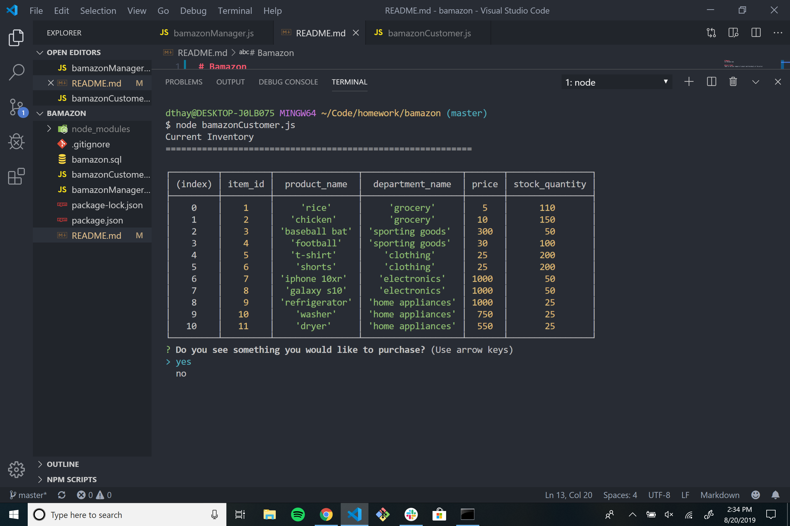
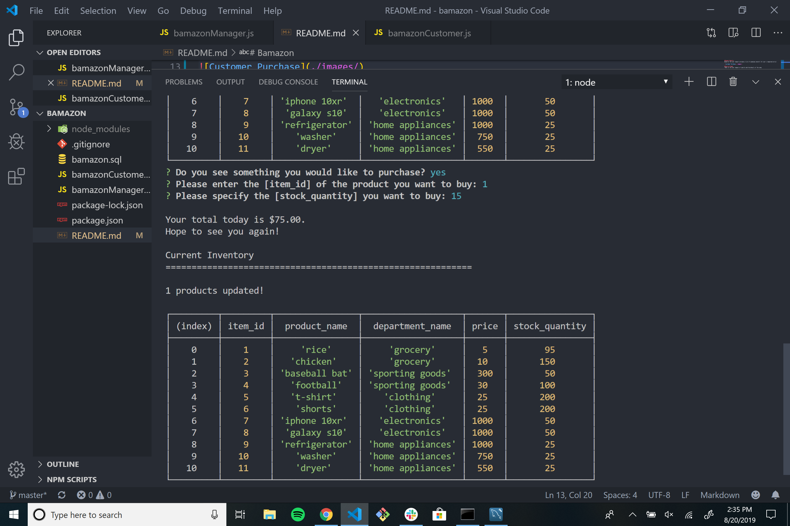
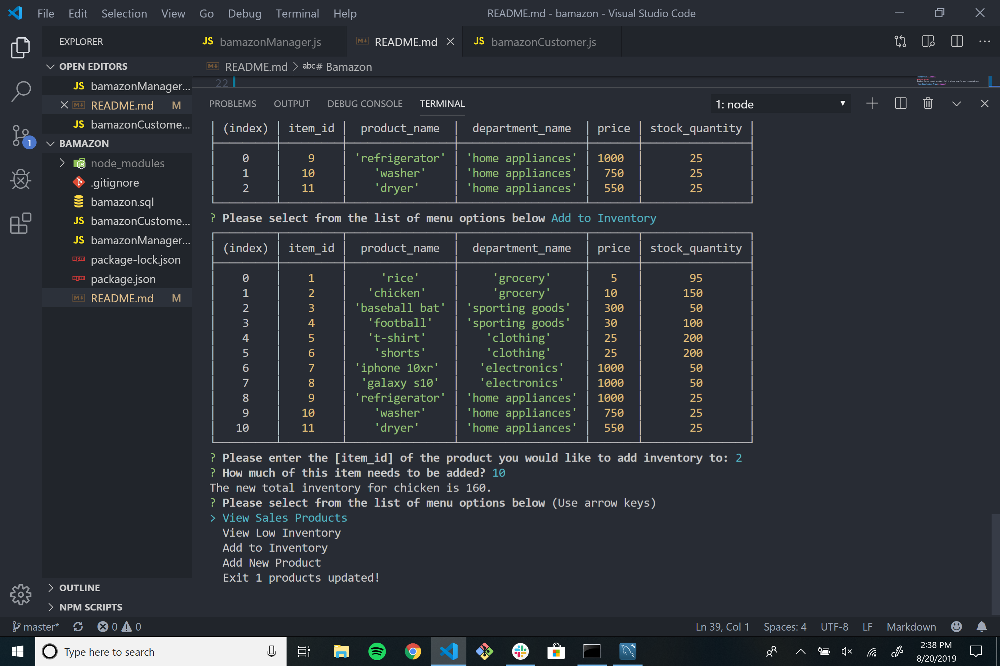
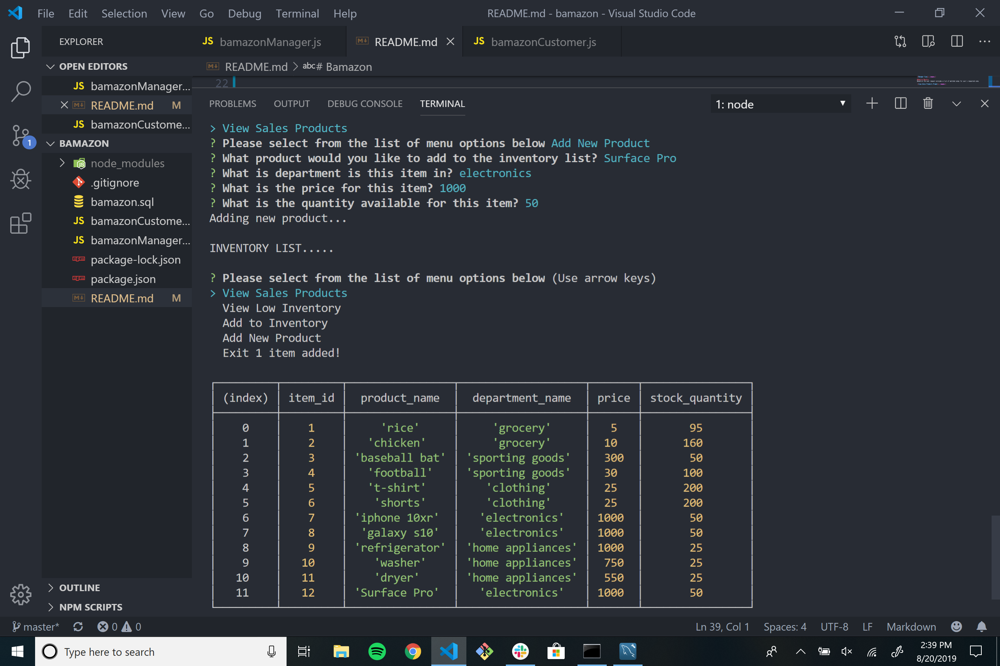
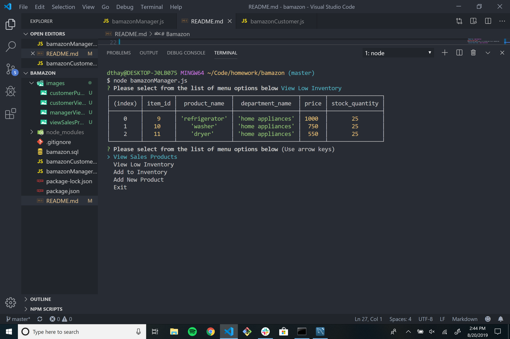
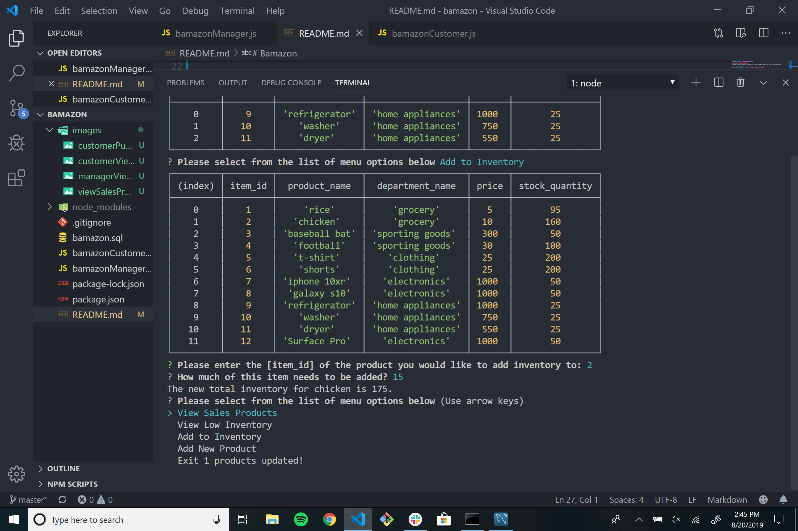
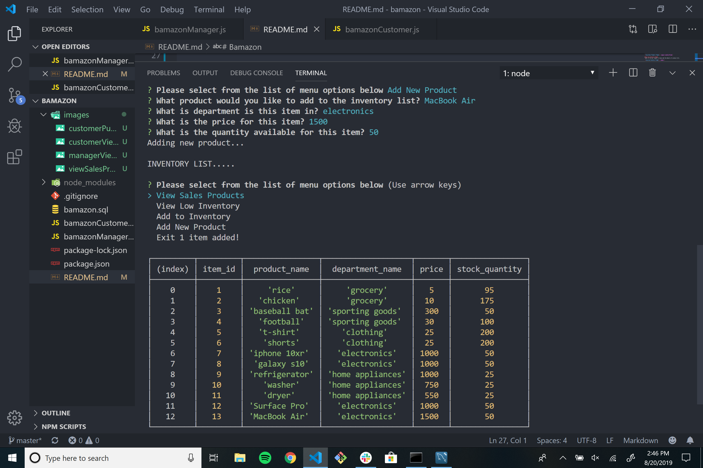

# Bamazon
CLI Database app

#Customer View
Shows the Customer the current inventory table and gives them the option to purchase or exit

#Customer Purchase
The Customer selects the item ID of the item they would like to purchase and the quantity. Then bamazon provides the customer their total purchase amount and updates the inventory.

#Manager View
Shows the Manager their options, view all products, view low inventory products only, increase inventory, or add a new item.

#View Sales Products Prompt
Shows the Manager all of the current items in inventory.

#View Low Inventory Prompt
Shows the Manger only the items that have a quantity fewer than 50.

#Add to Inventory Prompt
Gives the Manager the option to add additional inventory.

#Add New Product Prompt
Allows the Manager to add an entirely new item to the products table.

